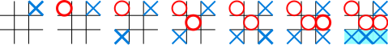

#Tic-Tac-Toe
###Version 1.0 (A simple backend for a Tic Tac Toe game using Google Cloud Endpoints, App Engine, and Python) 

####Description:
Tic-tac-toe is a  game for two players, X and O, who take turns marking the spaces in a 3×3 grid. The player who succeeds in placing three of their marks in a horizontal, vertical, or diagonal row wins the game.

This particular game have two levels: easy (randomly generated moves); hard (AI player) 

####Features: 
- Two Levels (AI Player is to be implemented using Minimax algorithm)
- User Profile and history 

####Setup Instructions:
- (todo)

####Files included:
- api.py: Contains endpoints and game playing logic.
- app.yaml: App configuration.
- cron.yaml: Cronjob configuration.
- main.py: Handler for taskqueue handler.
- models.py: Entity and message definitions including helper methods.
- utils.py: Helper function for retrieving ndb.Models by urlsafe Key string.

##Endpoints Included:
 - **create_user**
    - Path: 'user'
    - Method: POST
    - Parameters: user_name, email (optional)
    - Returns: Message confirming creation of the User.
    - Description: Creates a new User. user_name provided must be unique. Will 
    raise a ConflictException if a User with that user_name already exists.
    
 - **new_game**
    - Path: 'game'
    - Method: POST
    - Parameters: user_name, min, max, attempts
    - Returns: GameForm with initial game state.
    - Description: Creates a new Game. user_name provided must correspond to an
    existing user - will raise a NotFoundException if not. Min must be less than
    max. Also adds a task to a task queue to update the average moves remaining
    for active games.
     
 - **get_game**
    - Path: 'game/{urlsafe_game_key}'
    - Method: GET
    - Parameters: urlsafe_game_key
    - Returns: GameForm with current game state.
    - Description: Returns the current state of a game.
    
 - **make_move**
    - Path: 'game/{urlsafe_game_key}'
    - Method: PUT
    - Parameters: urlsafe_game_key, guess
    - Returns: GameForm with new game state.
    - Description: Accepts a 'guess' and returns the updated state of the game.
    If this causes a game to end, a corresponding Score entity will be created.
    
 - **get_scores**
    - Path: 'scores'
    - Method: GET
    - Parameters: None
    - Returns: ScoreForms.
    - Description: Returns all Scores in the database (unordered).
    
 - **get_user_scores**
    - Path: 'scores/user/{user_name}'
    - Method: GET
    - Parameters: user_name
    - Returns: ScoreForms. 
    - Description: Returns all Scores recorded by the provided player (unordered).
    Will raise a NotFoundException if the User does not exist.
    
 - **get_active_game_count**
    - Path: 'games/active'
    - Method: GET
    - Parameters: None
    - Returns: StringMessage
    - Description: Gets the average number of attempts remaining for all games
    from a previously cached memcache key.

##Models Included:
 - **User**
    - Stores unique user_name and (optional) email address.
    
 - **Game**
    - Stores unique game states. Associated with User model via KeyProperty.
    
 - **Score**
    - Records completed games. Associated with Users model via KeyProperty.
    
##Forms Included:
 - **GameForm**
    - Representation of a Game's state (urlsafe_key, attempts_remaining,
    game_over flag, message, user_name).
 - **NewGameForm**
    - Used to create a new game (user_name, min, max, attempts)
 - **MakeMoveForm**
    - Inbound make move form (guess).
 - **ScoreForm**
    - Representation of a completed game's Score (user_name, date, won flag,
    guesses).
 - **ScoreForms**
    - Multiple ScoreForm container.
 - **StringMessage**
    - General purpose String container.

